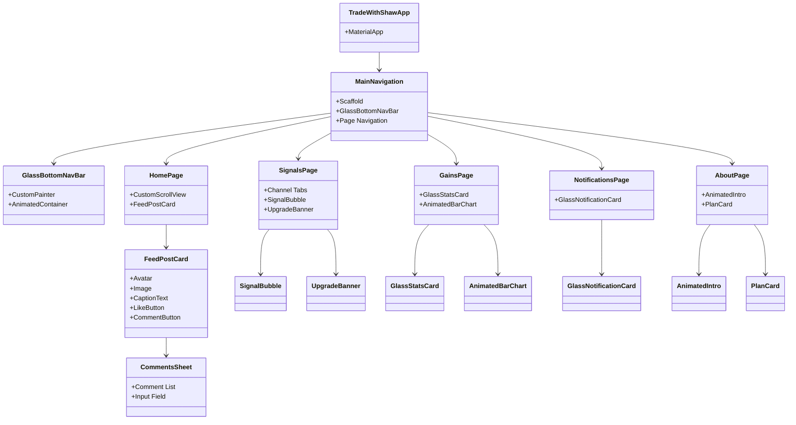

# Trade With Shaw

A beautiful, animated, and scalable Flutter application for the Trade With Shaw platform. This app is designed with a focus on premium UI/UX, glassmorphic effects, and high performance, providing users with a seamless trading education and signals experience.

---

## 🚀 Project Overview

**Trade With Shaw** is a mobile app that brings trading education, real-time signals, analytics, and subscription management to your fingertips. The app is built with Flutter, using a custom dark theme, glassmorphism, and modern navigation patterns.

---

## ✨ Features & Modules

- **Custom Glassmorphic Bottom Navigation Bar**
- **Instagram-like Animated Feed** (admin-only posts, images, captions, likes, comments)
- **Discord-style Signals Page** (free/premium channels, admin-only posts, upgrade banner)
- **Animated Gains Page** (stats, animated bar chart)
- **Notifications Page** (glassmorphic cards, swipe to dismiss)
- **About Page** (animated intro, interactive subscription plans)
- **Beautiful, consistent dark theme with gold accents**
- **Optimized for performance and scalability**

---

## 🏗️ Architecture & Theory

- **State Management:** Local state for UI, ready for Riverpod/Provider/Bloc for backend integration.
- **Navigation:** MainNavigation widget with a custom bottom nav bar and `PageView`/`IndexedStack` for smooth tab transitions.
- **UI Components:** Modular, reusable widgets for feed posts, comments, signals, analytics, and more.
- **Animations:** Animated entry, transitions, and micro-interactions throughout the app.
- **CustomScrollView & Slivers:** Used for scalable, performant feed and lists.

---

## 🗺️ Class Diagram



---

## 🎨 UI/UX Highlights

- **Glassmorphism:** Used in navigation, cards, dialogs, and overlays.
- **Animated Feed:** Smooth entry, image loading, expandable captions, likes, and comments.
- **Signals:** Discord-like, with premium lock overlay and upgrade prompts.
- **Charts:** Custom animated bar charts for analytics.
- **Responsive:** Looks great on all devices.

---

## 🛠️ How to Run

1. **Clone the repo:**
   ```bash
   git clone <this-repo-url>
   cd trade_with_shaw
   ```
2. **Install dependencies:**
   ```bash
   flutter pub get
   ```
3. **Add assets:**
   - Place your logo at `assets/TWS.png` and declare it in `pubspec.yaml`:
     ```yaml
     flutter:
       assets:
         - assets/TWS.png
     ```
4. **Run the app:**
   ```bash
   flutter run
   ```

---

## 🤝 Contribution Guide

- Fork the repo and create a feature branch.
- Follow the existing modular structure for new features.
- Write clean, well-documented code.
- Submit a pull request with a clear description.

---

## 🙏 Credits

- UI/UX: Inspired by modern trading and social apps.
- Built with [Flutter](https://flutter.dev/).
- Designed and engineered by the Trade With Shaw team.

---

## 📚 Further Reading
- [Flutter Documentation](https://docs.flutter.dev/)
- [Glassmorphism in Flutter](https://medium.com/flutter-community/glassmorphism-in-flutter-cc4b2b2b3c3a)
- [State Management Approaches](https://docs.flutter.dev/data-and-backend/state-mgmt/intro)

---

> **Trade With Shaw** — Empowering traders, one signal at a time.
